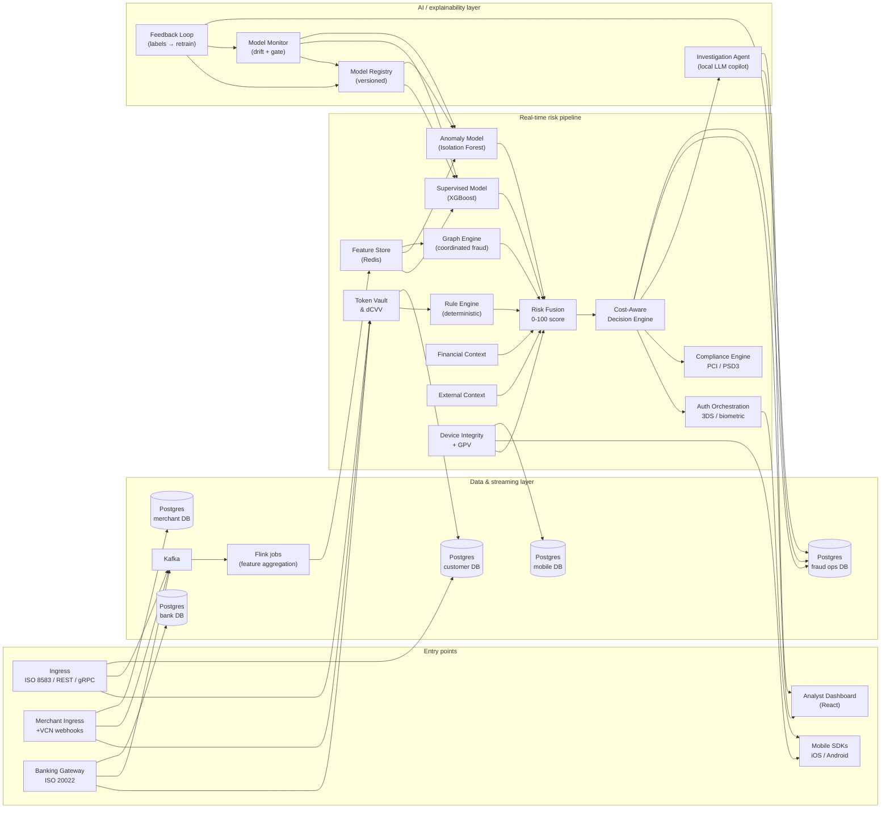

# VeriPay Architecture

See `PLAN.md` (sections 4–24) for the authoritative design. This document maps
each diagrammed box to its scaffold location and PLAN section.

## System architecture diagram

### Data flow (narrative)

1. **Ingestion** — transactions arrive over ISO 8583 (`0100`/`0110`/`0400`),
   REST, or gRPC at `services/ingress`, merchant webhooks at
   `services/merchant_ingress`, or core-banking messages at
   `services/banking_gateway`. Every raw event is published to Kafka and
   persisted by the owning database.
2. **Tokenization** — `services/token_vault` validates dynamic CVV and
   exchanges PANs for single-use virtual card numbers before anything else
   sees the data (PCI scope reduction).
3. **Streaming features** — Flink jobs consume Kafka, aggregate per-card,
   per-merchant, and per-account velocity/behavioral features, and write them
   to the Redis feature store.
4. **Scoring** — `services/rule_engine` applies deterministic hard rules;
   `services/supervised_model` (XGBoost), `services/anomaly_model` (Isolation
   Forest), and `services/graph_engine` produce model signals; financial and
   external context add normalized evidence; device integrity adds GPV and
   attestation signals.
5. **Fusion & decision** — `services/risk_fusion` combines every signal into
   the unified 0–100 score and four-tier risk band; `services/decision_engine`
   picks the cost-minimizing ALLOW / VERIFY / REVIEW / DECLINE action subject
   to compliance and blueprint tier constraints.
6. **Verification** — `services/auth_orchestration` drives push/biometric
   step-up against the mobile SDKs; `services/compliance_engine` enforces
   PCI-DSS 4.0, PSD3/SCA, and network zero-trust.
7. **Explainability** — `services/investigation_agent` generates governed
   natural-language explanations (advisory only; never an authorization
   decision) for the analyst dashboard.
8. **Learning** — analyst decisions flow back through
   `services/feedback_loop`, which records labels and triggers retraining;
   `ml/registry` version-stamps every model with its dataset fingerprint and
   metrics.

### API boundaries

| Boundary | Contract | Services |
|---|---|---|
| Transaction ingestion | REST `/api/v1/transactions` + gRPC | ingress, merchant_ingress, banking_gateway |
| Scoring | gRPC `proto/veripay/scoring/v1/scoring.proto` | supervised_model, anomaly_model, graph_engine |
| Risk evaluation | REST `/api/v1/risk/*`, `/api/v1/decision/evaluate` | rule_engine, risk_fusion, decision_engine |
| Investigation | REST `/api/v1/investigate/*` | investigation_agent |
| Analyst/portal | REST `/api/v1/*` (FI Ops, Business, Customer) | fi_ops_portal, business_portal, dispute_engine |
| Verification | gRPC + mobile SDK contracts | auth_orchestration, device_integrity |

### Where the AI lives

Fourth, the learning loop: `services/model_monitor` detects feature drift
(PSI) against the latest model's reference profile and triggers retraining on
base + labeled feedback from `services/feedback_loop`; a new version is
promoted to `latest` only when its held-out metrics clear a gate vs the
current champion.

Three AI surfaces compose the solution:

1. **Supervised model (XGBoost)** — learns fraud patterns from labeled
   transactions; produces a fraud probability that feeds risk fusion.
2. **Anomaly model (Isolation Forest)** — unsupervised; flags transactions
   that deviate from the account/merchant baseline even when no historical
   label exists.
3. **LLM investigation agent** — converts model output, features, and
   regulatory reason codes into analyst-readable explanations, with
   deterministic PII redaction and zero authorization authority.

All model artifacts are versioned in `ml/registry`; deterministic rule
findings remain explainable by construction (see `docs/ai-justification.md`).

## Database boundaries

VeriPay has five logical PostgreSQL databases. Fraud Operations has its own
database because it is an analyst-facing application with an independent
investigation and alert lifecycle:

| Database | Domain data |
|---|---|
| `veripay_customer_db` | Users, customers, accounts, devices, VCNs, transactions, security events |
| `veripay_bank_db` | Bank users, fraud and risk statistics, policies, model versions, disputes, audit logs, and settlement |
| `veripay_fraud_ops_db` | Fraud transactions, risk assessments and factors, alerts, investigations, and analyst actions |
| `veripay_merchant_db` | Merchants, merchant users, transactions, rules, limits, and disputes |
| `veripay_mobile_db` | Mobile users, registered devices, device security, verification, push tokens, and mobile audit logs |

Cross-database references are stored as stable IDs and validated by the owning
service. They intentionally do not use SQL foreign keys across databases.

Database migrations live under `datasets/migrations/` and are applied by the
Compose `migrate` service.

Services that persist relational data must set `POSTGRES_DSN` to the database
they own. The local host DSNs are:

| Service group | DSN database |
|---|---|
| Customer-facing ingress, token vault, and customer state | `veripay_customer_db` |
| Banking gateway, audit store, bank reporting, disputes, and settlement | `veripay_bank_db` |
| Fraud Operations portal, risk assessments, alerts, investigations, and analyst workflows | `veripay_fraud_ops_db` |
| Merchant ingress, merchant policy, corporate spend, and business portal | `veripay_merchant_db` |
| Device integrity and mobile authentication | `veripay_mobile_db` |

| Component | Location | PLAN |
|---|---|---|
| Ingress (ISO 8583 / REST / gRPC) | `services/ingress` | §5, §6.1 |
| Token Vault & dCVV Validation | `services/token_vault` | §6.1, §22 |
| Event Streaming (Kafka) | `infra/compose/kafka.yml` + `streaming/` | §9 |
| Real-time Streaming (Flink) | `streaming/jobs/` | §9 |
| Raw Event / Audit (Postgres) | `services/audit_store` | §22 |
| Online Feature Store (Redis) | `services/feature_store` | §8, §9 |
| Supervised Model (XGBoost) | `services/supervised_model` + `ml/supervised` | §10 |
| Anomaly (Isolation Forest) | `services/anomaly_model` + `ml/anomaly` | §11 |
| Graph Risk Engine | `services/graph_engine` + `ml/graph` | §12 |
| Rule / Security Engine | `services/rule_engine` | §13 |
| Financial Context | `services/financial_context` | §17 |
| External Context | `services/external_context` | §17 |
| Device Integrity + GPV | `services/device_integrity` + `mobile/` | §14, §15 |
| Risk Fusion | `services/risk_fusion` + `ml/fusion` | §18 |
| Cost-Aware Decision Router | `services/decision_engine` | §19 |
| LLM Investigation / Explainability | `services/investigation_agent` | §20 |
| Auth Orchestration (3DS/Biometric) | `services/auth_orchestration` | §16 |
| Human Feedback Loop | `services/feedback_loop` | §21 |
| Model Monitor (drift + gated retraining) | `services/model_monitor` + `ml/drift` | §10, §21 |
| Analyst Dashboard | `web/` | §20 |
| Contracts (gRPC) | `proto/veripay/` | all |
| Shared enums/constants | `libs/veripay_common`, `libs/veripay_ts` | all |

## Expansion: Banking/FI + Business/Merchant

| Component | Location | Expansion § |
|---|---|---|
| Banking Gateway (ISO 20022) | `services/banking_gateway` | §1 Dev1, §2 |
| Merchant Ingress (VCN, webhooks) | `services/merchant_ingress` | §1 Dev1, §2 |
| Corporate Spend Service | `services/corporate_spend` | §1 Dev1, §2 |
| Settlement Sync | `streaming/jobs/settlement_sync.py` | §1 Dev2 |
| Merchant Aggregations | `streaming/jobs/merchant_aggregations.py` | §1 Dev2 |
| Issuer Risk Models | `ml/issuer_risk/` | §1 Dev3 |
| Fraud Ring Engine | `ml/fraud_ring/` | §1 Dev3 |
| Merchant Risk Models | `ml/merchant_risk/` | §1 Dev3 |
| B2B Credit Risk | `ml/b2b_credit/` | §1 Dev3 |
| Merchant Policy Engine | `services/merchant_policy` | §1 Dev4, §2 |
| Compliance Engine (PCI/PSD3) | `services/compliance_engine` | §1 Dev4, §2 |
| Dispute Engine | `services/dispute_engine` | §1 Dev5, §3 |
| Dispute Sync (→ Iceberg) | `streaming/jobs/dispute_sync.py` | §1 Dev5, §3 |
| FI Ops Portal | `services/fi_ops_portal` + `web/src/pages/FiOpsConsole.tsx` | §1 Dev5, §2 |
| Business Portal | `services/business_portal` + `web/src/pages/BusinessTreasury.tsx` | §1 Dev5, §2 |

See `docs/developer-ownership.md` for the full 5-developer work-tree map.

## Shared boundary (merge-coordination point)
- `proto/` — wire contracts
- `libs/` — read-only shared code mirroring proto

Everything else is owned by exactly one work-tree.
